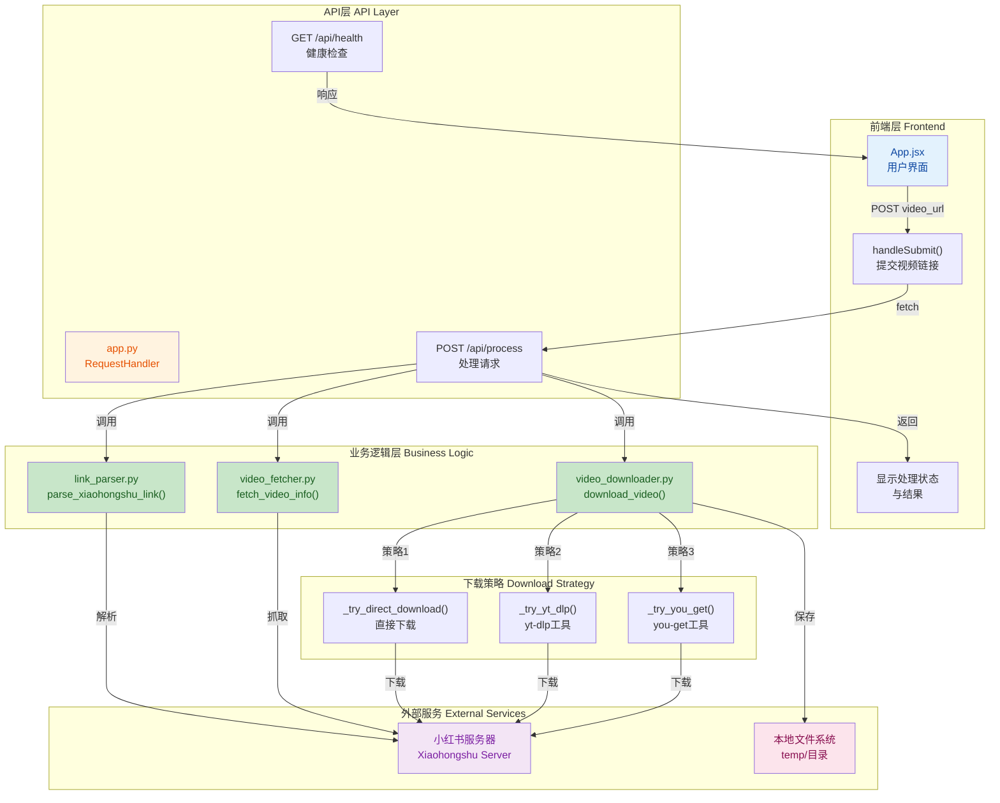

## 1. 高层摘要 (TL;DR)

*   **影响范围**: **高** - 这是一个全新的全栈应用实现，包含完整的后端服务（Python）和前端界面（React + Vite），用于处理小红书视频的下载和信息提取。
*   **核心变更**:
    *   ✨ 新建完整的 **LLM Wiki Processor** 项目架构
    *   🔧 实现视频链接解析、信息获取、下载三大核心模块
    *   🎨 构建基于 React + Tailwind CSS 的现代化前端界面
    *   📝 提供详细的实现计划和项目文档

---

## 2. 可视化概览 (代码与逻辑图)



**系统架构说明**:
- **前端层**: React 应用提供用户界面，处理用户输入和结果展示
- **API层**: Python HTTP 服务器提供 RESTful API 接口
- **业务逻辑层**: 三个核心模块分别负责链接解析、信息获取和视频下载
- **下载策略**: 采用多策略降级机制，确保下载成功率
- **外部服务**: 与小红书服务器交互，下载内容保存到本地

---

## 3. 详细变更分析

### 📦 组件一: 后端服务 (Backend)

#### 1.1 主应用 (`app.py`)

**变更内容**:
- 使用 Python 内置 `http.server` 实现 HTTP 服务器（端口 3001）
- 实现了 CORS 跨域支持，允许前端调用
- 提供两个 API 端点：
  - `GET /api/health` - 健康检查
  - `POST /api/process` - 视频处理主流程

**核心处理流程**:
```python
# 1. 解析视频链接
link_info = parse_xiaohongshu_link(video_url)

# 2. 获取视频信息
video_info = fetch_video_info(video_id, video_url)

# 3. 下载视频
download_path = download_video(video_info, temp_dir)
```

#### 1.2 链接解析模块 (`link_parser.py`)

**支持的小红书链接格式**:

| 格式类型 | 正则表达式模式 | 示例 |
|---------|--------------|------|
| 官方视频链接 | `xiaohongshu\.com/explore/([a-zA-Z0-9]+)` | `https://www.xiaohongshu.com/explore/69b824b0000000001d01c798` |
| 分享链接 | `xhslink\.com/[^/]+/([a-zA-Z0-9]+)` | `https://xhslink.com/xxx/69b824b0000000001d01c798` |
| 其他格式 | `xiaohongshu\.com/video/([a-zA-Z0-9]+)` | `https://www.xiaohongshu.com/video/69b824b0000000001d01c798` |

**关键函数**:
- `parse_xiaohongshu_link(link)` - 解析链接提取 video_id
- `validate_xiaohongshu_link(link)` - 验证链接有效性

#### 1.3 视频信息获取模块 (`video_fetcher.py`)

**功能特性**:
- 访问原始链接并跟随重定向
- 从 HTML 内容中提取视频 URL（支持多种格式）
- 提取视频元数据：标题、作者、描述等

**视频 URL 提取模式**:
```python
video_patterns = [
    r'(https?://[^\s<>"\']+\.mp4)',      # 直接MP4链接
    r'(https?://[^\s<>"\']+\.m3u8)',     # HLS流链接
    r'videoUrl["\']\s*[:=]\s*["\']([^"\']+)',  # JSON字段
    r'media["\']\s*[:=]\s*["\']([^"\']+)',
    r'originVideoKey["\']\s*[:=]\s*["\']([^"\']+)',
]
```

#### 1.4 视频下载模块 (`video_downloader.py`)

**多策略下载机制**:

| 策略 | 优先级 | 说明 | 工具依赖 |
|-----|-------|------|---------|
| 直接下载 | 1 | 使用 requests 下载真实视频URL | 无 |
| yt-dlp (原始链接) | 2 | 使用 yt-dlp 下载原始链接 | yt-dlp |
| you-get (原始链接) | 3 | 使用 you-get 下载原始链接 | you-get |
| yt-dlp (视频URL) | 4 | 使用 yt-dlp 下载视频URL | yt-dlp |
| you-get (视频URL) | 5 | 使用 you-get 下载视频URL | you-get |

**关键函数**:
- `download_video(video_info, output_dir)` - 主下载函数
- `_try_yt_dlp(video_url, output_path)` - yt-dlp 下载
- `_try_you_get(video_url, output_dir)` - you-get 下载
- `_try_direct_download(video_url, output_path)` - 直接下载
- `_check_download_tools()` - 检查工具是否安装

#### 1.5 依赖配置 (`requirements.txt`)

| 包名 | 版本 | 用途 |
|-----|------|------|
| fastapi | 0.104.1 | Web框架（预留） |
| uvicorn | 0.24.0 | ASGI服务器（预留） |
| aiofiles | 23.2.1 | 异步文件操作 |
| requests | 2.31.0 | HTTP请求 |
| python-multipart | 0.0.6 | 文件上传支持 |
| pydantic | 2.5.0 | 数据验证 |
| pydantic-settings | 2.1.0 | 配置管理 |
| python-dotenv | 1.0.0 | 环境变量 |

---

### 🎨 组件二: 前端应用 (Frontend)

#### 2.1 主应用组件 (`App.jsx`)

**功能特性**:
- ✅ 视频链接输入与实时验证
- ✅ 处理状态显示（处理中/成功/失败）
- ✅ 视频信息展示（标题、作者、时长、互动数据）
- ✅ 下载路径显示
- ✅ 错误提示与用户反馈

**状态管理**:
```javascript
const [videoUrl, setVideoUrl] = useState('')
const [isProcessing, setIsProcessing] = useState(false)
const [status, setStatus] = useState('')
const [result, setResult] = useState(null)
const [error, setError] = useState('')
const [isValid, setIsValid] = useState(true)
```

#### 2.2 前端依赖 (`package.json`)

| 依赖 | 版本 | 用途 |
|-----|------|------|
| react | ^18.2.0 | UI框架 |
| react-dom | ^18.2.0 | React DOM |
| vite | ^5.0.8 | 构建工具 |
| tailwindcss | ^3.4.0 | CSS框架 |
| @vitejs/plugin-react | ^4.2.1 | Vite React插件 |

#### 2.3 构建配置

**Vite 配置** (`vite.config.js`):
- 开发服务器端口: 3000
- API 代理: `/api` → `http://localhost:3001`

**Tailwind 配置** (`tailwind.config.js`):
- 自定义颜色主题
- 字体配置: Inter, system-ui

---

### 📄 组件三: 项目文档与配置

#### 3.1 项目文档

| 文件 | 内容 |
|-----|------|
| `README.md` | 项目说明、安装指南、API文档、使用指南 |
| `video_download_module_plan.md` | 详细实现计划、技术选型、风险分析、时间线 |
| `prompt.md` | 原始需求说明 |

#### 3.2 配置文件

| 文件 | 用途 |
|-----|------|
| `.gitignore` | Git忽略规则（Python、Node、临时文件等） |
| `start.bat` | Windows一键启动脚本（安装依赖+启动服务） |

---

## 4. 影响与风险评估

### ⚠️ 潜在风险

| 风险项 | 严重程度 | 说明 | 应对建议 |
|-------|---------|------|---------|
| **小红书反爬机制** | 高 | 小红书可能更新API或增加反爬措施 | 定期更新解析逻辑，添加请求重试和延迟 |
| **下载工具依赖** | 中 | 需要系统安装 yt-dlp 或 you-get | 在文档中明确说明，提供安装指引 |
| **端口冲突** | 低 | 3000/3001端口可能被占用 | 提供端口配置选项 |
| **跨域问题** | 低 | 生产环境可能需要更严格的CORS配置 | 根据部署环境调整CORS设置 |

### ✅ 测试建议

1. **链接解析测试**:
   - 测试官方链接格式
   - 测试 xhslink 分享链接
   - 测试无效链接的错误处理

2. **视频下载测试**:
   - 测试不同下载策略的降级机制
   - 测试大文件下载的稳定性
   - 测试网络中断后的重试逻辑

3. **前端交互测试**:
   - 测试表单验证逻辑
   - 测试处理状态的实时更新
   - 测试错误信息的正确显示

4. **端到端测试**:
   - 完整流程：输入链接 → 解析 → 下载 → 展示结果
   - 异常流程：无效链接 → 错误提示 → 恢复

---

## 5. 技术亮点

🌟 **多策略下载机制**: 采用降级策略，优先使用直接下载，失败后依次尝试 yt-dlp 和 you-get，确保高成功率

🌟 **模块化设计**: 后端分为链接解析、信息获取、视频下载三个独立模块，职责清晰，易于维护

🌟 **现代化前端**: 使用 React 18 + Vite + Tailwind CSS，提供流畅的用户体验和响应式设计

🌟 **完整的错误处理**: 从链接验证到下载失败，每个环节都有详细的错误处理和用户反馈

🌟 **详细的文档**: 包含实现计划、API文档、使用指南，便于团队协作和后续维护

---

## 6. 后续扩展方向

根据 `prompt.md` 中的需求，系统还需要实现以下功能：

1. **音频提取模块**: 从下载的视频中提取音频轨道
2. **语音转文字模块**: 使用 ASR（自动语音识别）技术将音频转换为文本
3. **内容摄入模块**: 将转换后的文本整合到 LLM Wiki 知识库
4. **批量处理**: 支持一次性处理多个视频链接
5. **进度条显示**: 在前端显示详细的下载和处理进度
6. **视频预览**: 在前端提供视频预览功能