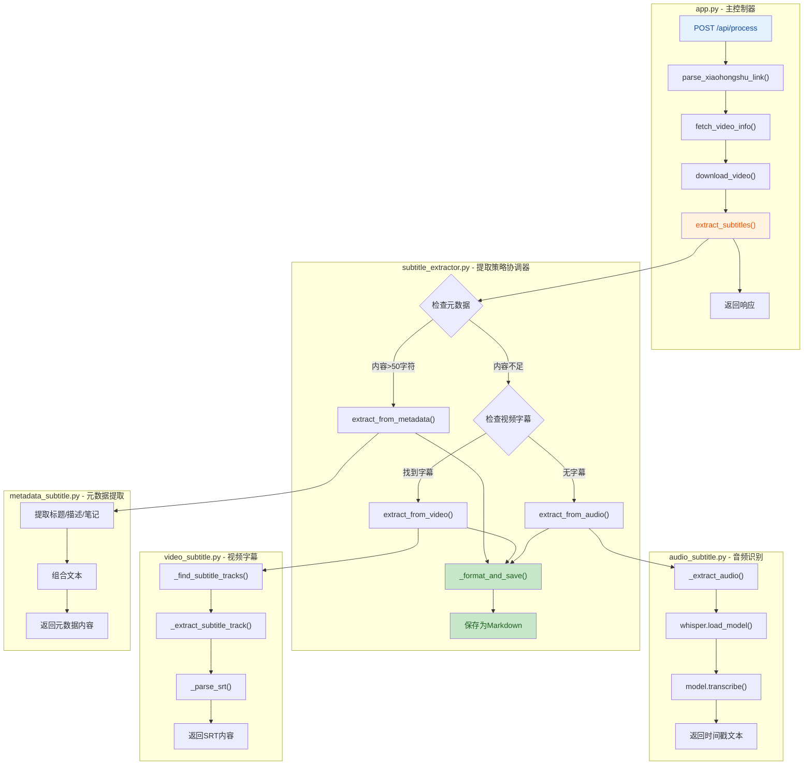
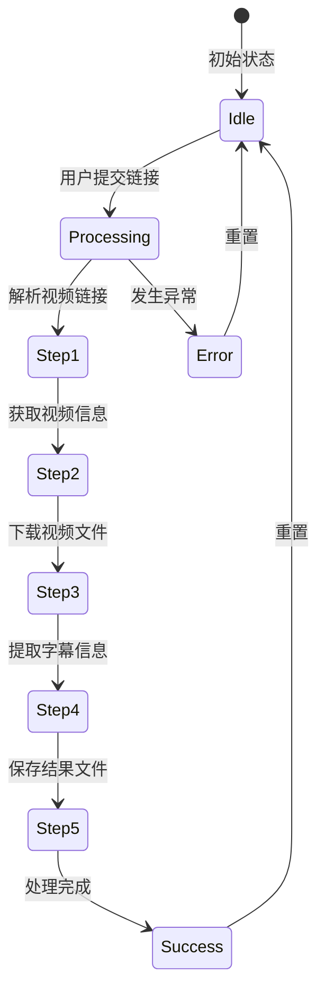

## 1. 高层摘要 (TL;DR)

*   **影响范围:** **高** - 新增完整的字幕提取模块，集成AI语音识别能力，并大幅改进前端用户体验
*   **核心变更:**
    *   ✨ 新增 `subtitle_extractor` 模块，支持三种字幕提取策略（元数据→视频字幕→音频识别）
    *   🤖 集成 **OpenAI Whisper** 进行语音转文字
    *   🎨 前端新增步骤指示器、进度条、实时日志展示
    *   📦 添加依赖项：`ffmpeg-python`、`openai-whisper`、`pydub`、`python-dotenv`
    *   🚀 新增 Windows 批处理脚本，简化服务启动/停止流程

---

## 2. 可视化概览 (代码与逻辑图)

### 字幕提取流程



### 前端状态流转



---

## 3. 详细变更分析

### 📦 后端核心模块

#### 3.1 新增字幕提取模块 (`subtitle_extractor/`)

| 文件 | 功能 | 关键方法 |
|------|------|----------|
| `__init__.py` | 模块入口 | 导出 `extract_subtitles` |
| `subtitle_extractor.py` | 主控制器 | `extract_subtitles()`, `_format_and_save()`, `_build_markdown_content()` |
| `metadata_subtitle.py` | 元数据提取 | `extract_from_metadata()` - 提取标题/描述/笔记内容 |
| `video_subtitle.py` | 视频字幕提取 | `extract_from_video()`, `_find_subtitle_tracks()`, `_parse_srt()` |
| `audio_subtitle.py` | 音频识别 | `extract_from_audio()`, `_transcribe_audio()` - 使用Whisper |

**提取策略优先级:**
1. **元数据** (最快) - 检查是否有实质性内容（>50字符）
2. **视频内置字幕** (中等) - 使用FFmpeg提取SRT轨道
3. **音频识别** (最慢但最准确) - 使用Whisper模型进行语音转文字

#### 3.2 主应用更新 (`app.py`)

**变更内容:**
- 导入新模块: `from modules.subtitle_extractor import extract_subtitles`
- 创建输出目录: `output_dir` 用于保存Markdown字幕文件
- 集成字幕提取流程，在视频下载后自动调用
- 改进错误处理，添加详细的traceback输出

**新增代码片段:**
```python
# 提取字幕
subtitle_result = extract_subtitles(
    download_path,
    video_info,
    output_dir
)

# 构建响应
response = {
    "status": "success",
    "video_info": video_info,
    "download_path": download_path,
    "subtitle_result": subtitle_result,  # 新增
    "message": "Video processed successfully"
}
```

#### 3.3 视频信息提取增强 (`video_fetcher.py`)

**新增功能:**
- 提取小红书笔记内容 (`note_content`)
- 支持多种模式匹配: `desc`, `content`, `note`

**新增字段:**
```python
video_info = {
    # ... 原有字段
    'note_content': note_content,  # 新增
}
```

#### 3.4 依赖项更新 (`requirements.txt`)

| 包名 | 版本 | 用途 |
|------|------|------|
| `ffmpeg-python` | >=0.2.0 | FFmpeg Python绑定，用于视频/音频处理 |
| `openai-whisper` | >=20231117 | OpenAI的语音识别模型 |
| `pydub` | >=0.25.1 | 音频处理库 |
| `python-dotenv` | >=1.0.0 | 环境变量管理 |
| `pyyaml` | >=6.0 | YAML配置文件解析 |

#### 3.5 配置文件新增 (`config.yaml`)

**新增配置项:**

| 配置项 | 默认值 | 说明 |
|--------|--------|------|
| `whisper.model` | `small` | Whisper模型大小（tiny/base/small/medium/large） |
| `subtitle.language` | `zh` | 默认识别语言 |
| `output.keep_video` | `false` | 是否保留原始视频文件 |
| `output.keep_audio` | `false` | 是否保留提取的音频文件 |

---

### 🎨 前端用户体验升级 (`App.jsx`)

#### 3.6 新增状态管理

| 状态变量 | 类型 | 用途 |
|----------|------|------|
| `currentStep` | number | 当前处理步骤 (0-4) |
| `progress` | number | 进度百分比 (0-100) |
| `logs` | array | 实时日志记录 |
| `showResult` | boolean | 控制结果显示 |
| `showProgress` | boolean | 控制进度显示 |

#### 3.7 步骤指示器

定义了5个处理步骤：
1. 🔍 解析视频链接
2. 📋 获取视频信息
3. 📥 下载视频文件
4. 📝 提取字幕信息
5. 💾 保存结果文件

#### 3.8 结果展示增强

**新增字幕信息展示:**
- 字幕来源（元数据/视频/音频）
- 置信度显示
- Markdown输出文件路径
- 字幕内容预览（带复制功能）

**UI改进:**
- 步骤进度可视化（圆形图标 + 动画）
- 进度条动画
- 实时日志滚动窗口
- 一键复制字幕内容

---

### 🚀 运维脚本

#### 3.9 Windows批处理脚本

| 脚本 | 功能 |
|------|------|
| `start-all.bat` | 一键启动前后端服务，自动处理端口占用 |
| `start-backend.bat` | 启动后端服务器（端口3001），支持虚拟环境 |
| `start-frontend.bat` | 启动前端开发服务器（端口3000），自动安装依赖 |
| `stop-all.bat` | 停止所有服务，可选终止Python/Node进程 |

**特性:**
- ✅ 自动检测并清理端口占用
- ✅ 支持虚拟环境自动激活
- ✅ 首次运行自动安装依赖
- ✅ 友好的控制台输出

---

### 📁 配置文件更新

#### 3.10 `.gitignore` 更新

```diff
+output/
+test_output/
```

**说明:** 忽略字幕输出目录，避免将生成的Markdown文件提交到版本控制。

---

## 4. 影响与风险评估

### ⚠️ 破坏性变更

| 变更类型 | 影响范围 | 说明 |
|----------|----------|------|
| **API响应结构** | 前端 | `POST /api/process` 响应新增 `subtitle_result` 字段 |
| **依赖要求** | 后端 | 需要安装FFmpeg和Whisper模型（首次下载约~1GB） |
| **磁盘空间** | 系统 | 需要额外空间存储音频临时文件和输出文件 |

### 🔍 测试建议

#### 后端测试
1. **元数据提取测试**
   - 验证只包含标题的视频不会误判为有字幕
   - 测试包含描述/笔记内容的视频能正确提取

2. **视频字幕测试**
   - 测试带SRT字幕的视频能正确提取
   - 测试无字幕视频能正确降级到音频识别

3. **音频识别测试**
   - 验证Whisper模型加载和识别功能
   - 测试不同语言视频的识别准确率
   - 测试长时间视频的处理稳定性

4. **错误处理测试**
   - 测试FFmpeg未安装时的降级处理
   - 测试网络异常时的错误提示

#### 前端测试
1. **进度展示测试**
   - 验证步骤指示器正确更新
   - 测试进度条动画流畅性
   - 验证日志实时显示

2. **结果展示测试**
   - 验证字幕信息正确渲染
   - 测试复制功能
   - 测试不同字幕来源的显示

3. **边界情况测试**
   - 测试空输入验证
   - 测试无效链接处理
   - 测试长时间处理时的用户体验

#### 运维测试
1. **脚本测试**
   - 测试端口占用检测和清理
   - 测试服务启动顺序
   - 测试服务停止功能

### 📝 注意事项

1. **FFmpeg依赖**: 系统必须安装FFmpeg并添加到PATH环境变量
2. **Whisper模型**: 首次使用会自动下载模型，需要稳定的网络连接
3. **性能考虑**: 音频识别是CPU密集型操作，建议在服务器端运行
4. **临时文件清理**: 音频提取的临时WAV文件会在处理后自动删除
5. **输出目录**: 确保 `output/` 目录有写入权限

---

## 5. 总结

本次更新为 **LLM Wiki Processor** 项目添加了完整的字幕提取功能，采用**多策略降级方案**确保在各种场景下都能获取到字幕内容。前端用户体验得到显著提升，新增的进度可视化和实时日志功能让处理过程更加透明。Windows批处理脚本简化了开发环境的启动流程，提升了开发效率。

**技术亮点:**
- 🎯 智能提取策略（元数据→视频→音频）
- 🤖 集成OpenAI Whisper进行高精度语音识别
- 📊 实时进度反馈和日志系统
- 🔧 完善的错误处理和降级机制